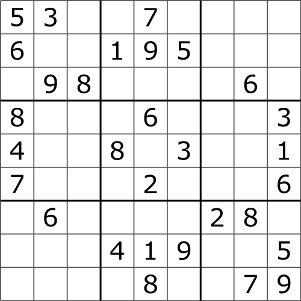
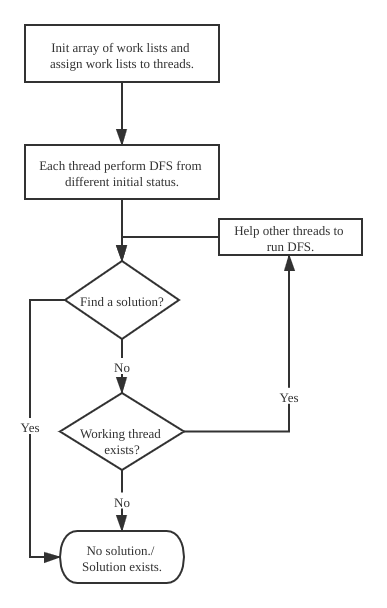
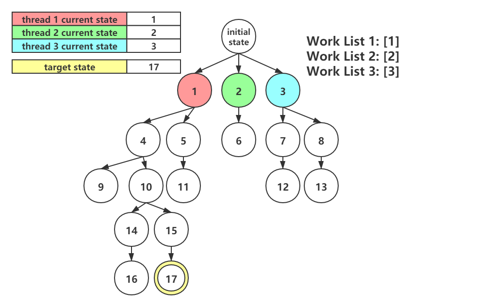
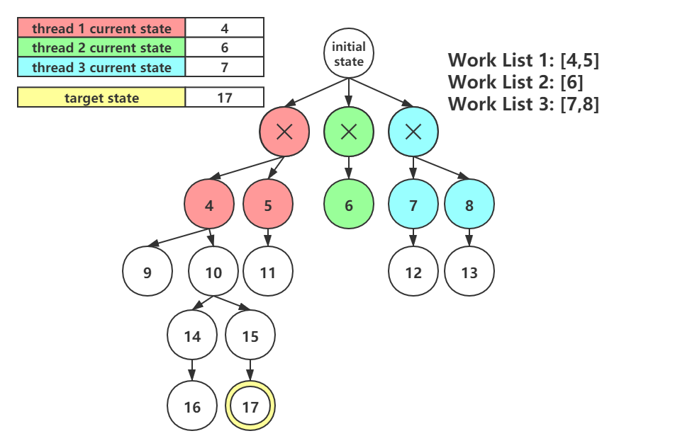
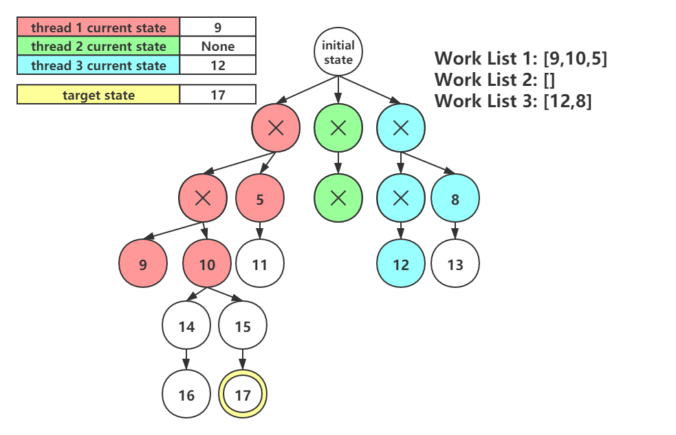
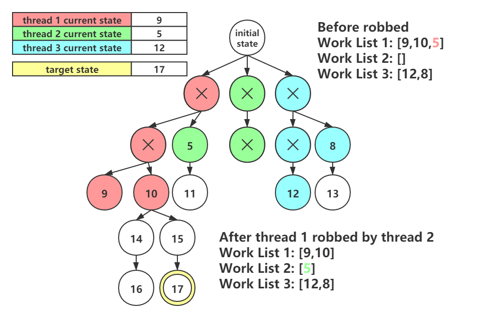
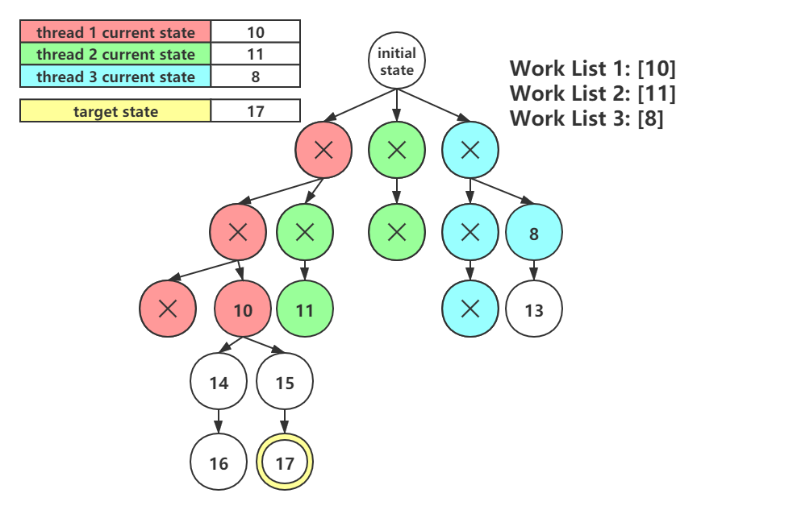
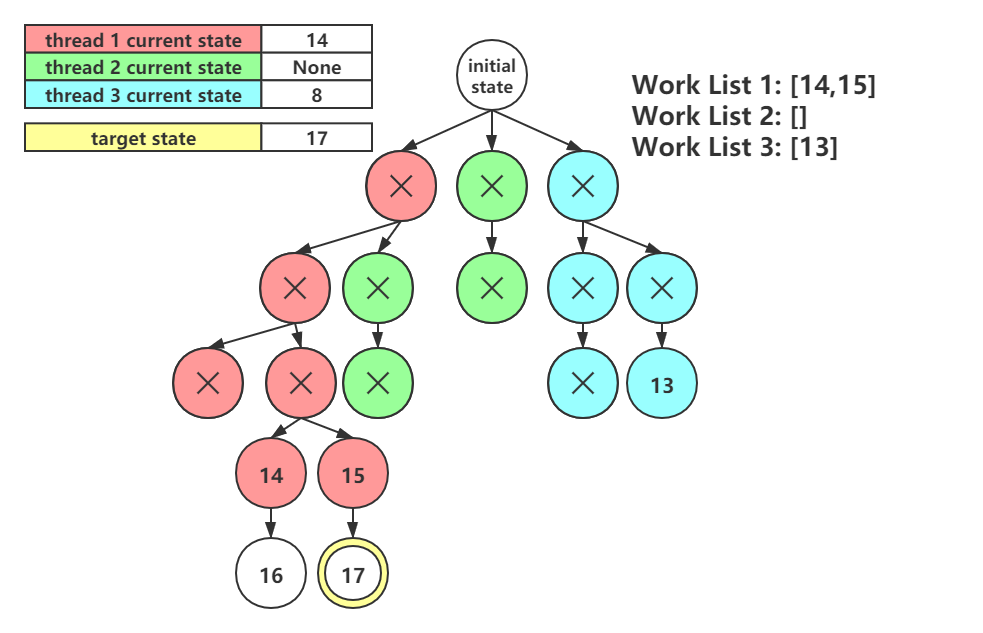
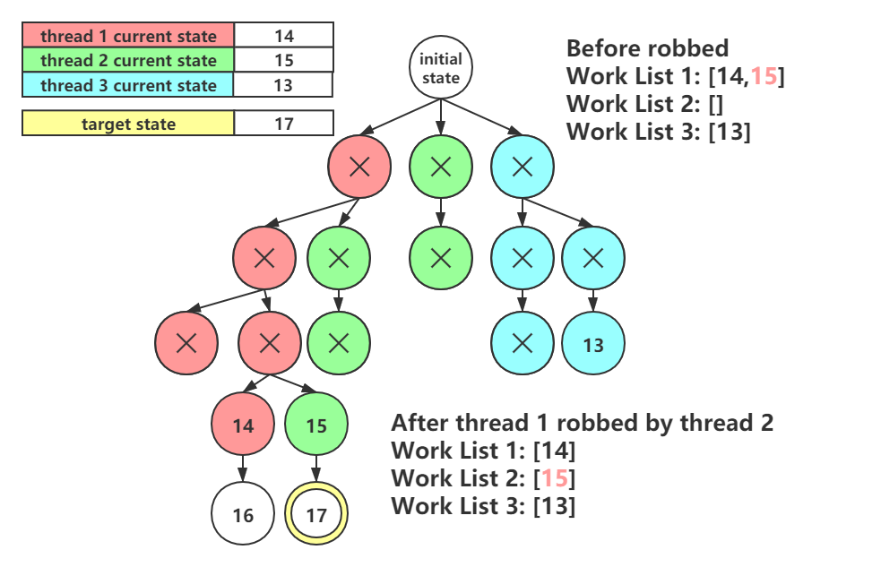

# Parallel Sudoku Solver

In 2020 fall CSCI 596 final project, we build a parallel sudoku solver using OpenMP to parallelize backtracking algorithm on Sudoku.


### What is Sudoku

#### Rules (for standard Sudoku)

1. A standard Sudoku contains 81 cells in a 9 by 9 grid. 

2. Each cell contains a number from 1-9. 

3. Each number can only occur once in each row, column, and 3 by 3 box.

#### Commonly Algorithms

1. **Brute Force**: Require a long execution time.
2. **Humanistic Algorithm**: Quick solving method but it may not solve a Sudoku if not applying other methods.
3. **Backtracking**: Performing DFS with pruning strategy, guaranteeing a solution if it exists.


### Parallel DFS

Noticing that order of DFS won't change the solution of Sudoku, we could parallelize our DFS procedure.

Initially, each thread starts at a different state and perform single thread searching strategy.

Once a thread is idle (finishing its current work), it tries to find some works from other threads.



#### An example of parallel DFS traversal










#### Race Condition

##### Race condition on work list

Each thread holds a work list to track its current state and record the remaining work. When one thread finishes its work, it tries to find other works from other threads by examining work lists of other threads.

Work list will be read and changed by different threads, which cause a race condition.

While maintaining work lists, we use `#pragma omp critical` to ensure read and write consistency.

##### Race condition on mask updates

TODO


### Experiments and Results

TODO (Execution time, Speed up, Efficiency)


### Conclusion

TODO


### Run

```shell
mkdir build
cd build
cmake ..
make
./sudoku-solver <sudoku-file>
```

